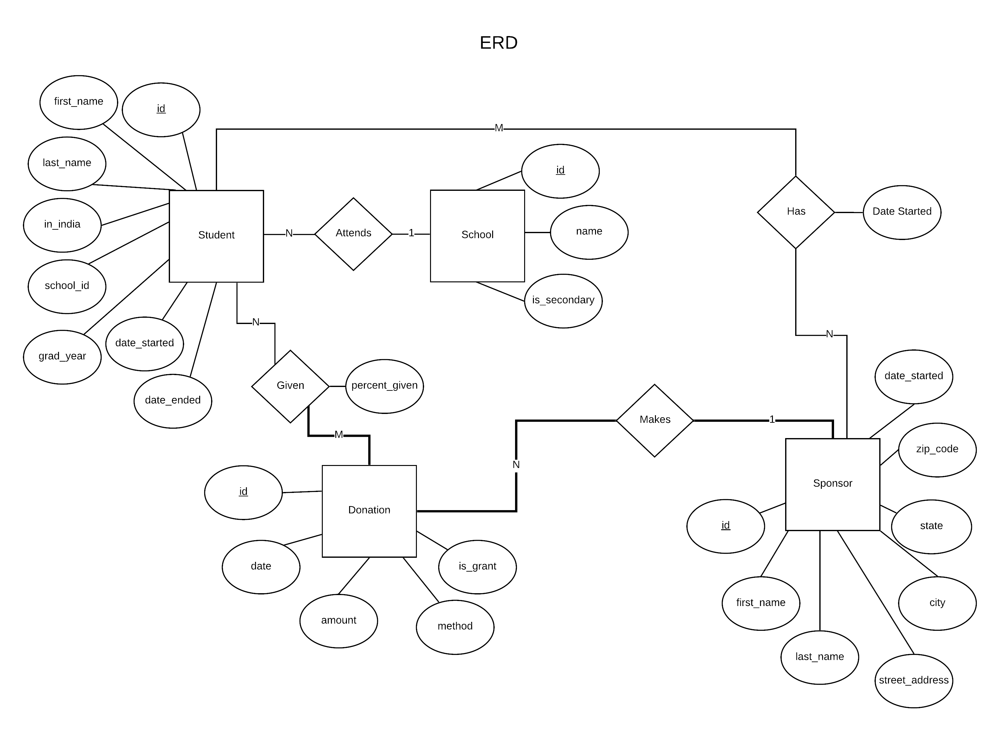

# Nonprofit Management Database

Mock database to be used for managing an education nonprofit that requires tracking relationships between sponsors, students and donations.


## Getting Started

These instructions will get you a local copy of the project up and running on your machine.

### Installing
```
git clone https://github.com/code-tsunami/nonprofitmgmt
cd nonprofitmgmt
```

### Usage

```sh
npm i
npm start
```

## Built With

* [MySQL](https://www.npmjs.com/package/mysql) - NodeJS driver for MySQL (wrote raw SQL queries)
* [Express](https://expressjs.com/) - NodeJS web framework
* [NodeJS](https://nodejs.org/en/) - JS runtime
* [Pug](https://github.com/pugjs/pug) - Templating engine

## Author

* **Sonam Kindy** - [code-tsunami](https://github.com/code-tsunami)

## License

This project is licensed under the MIT License - see the [LICENSE](LICENSE) file for details.
